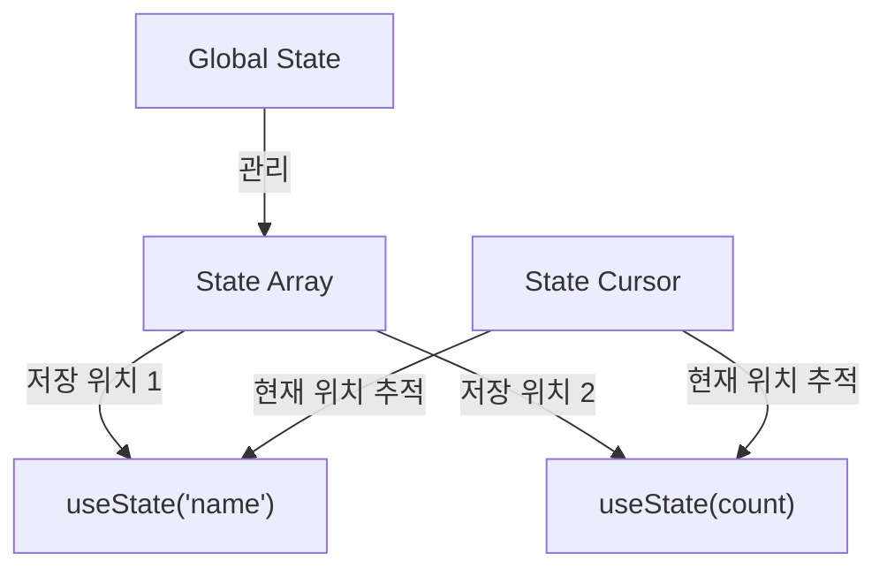
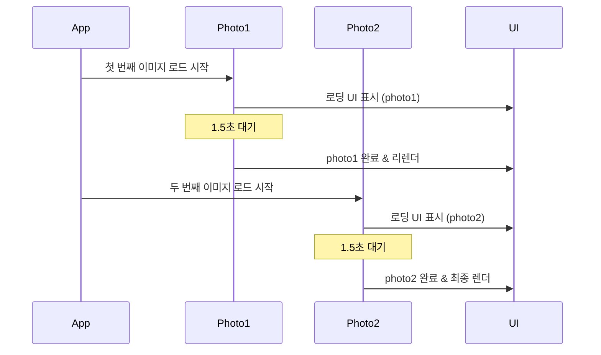
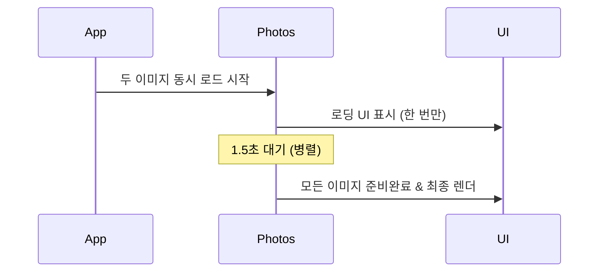
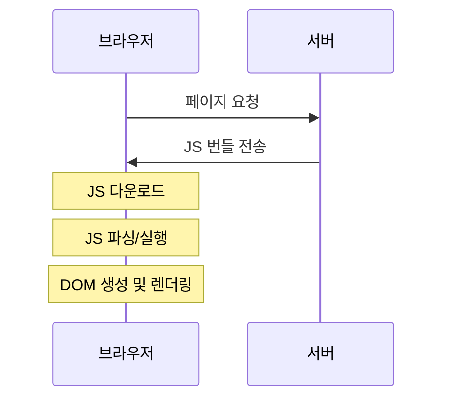
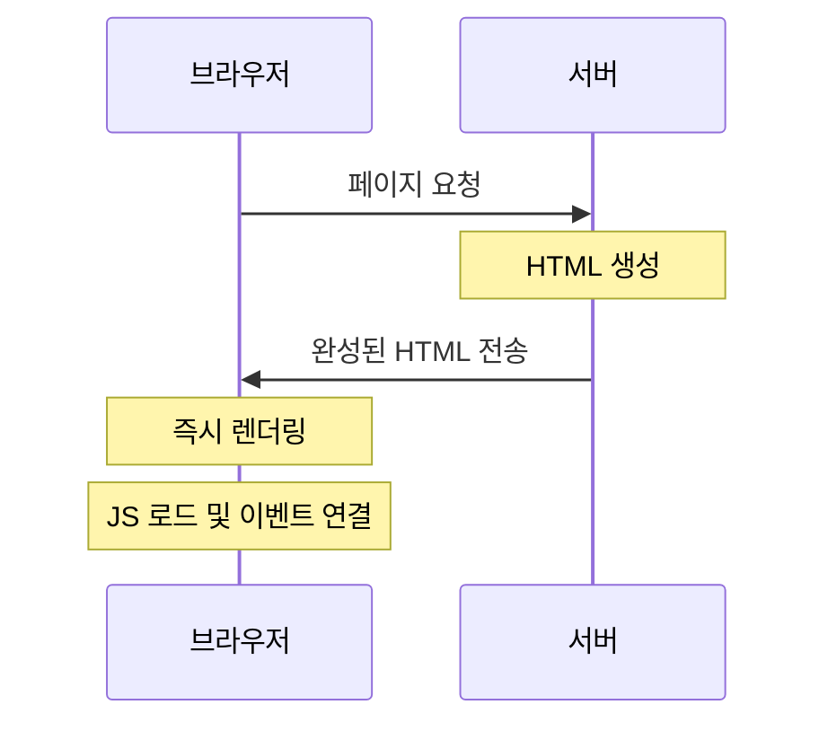
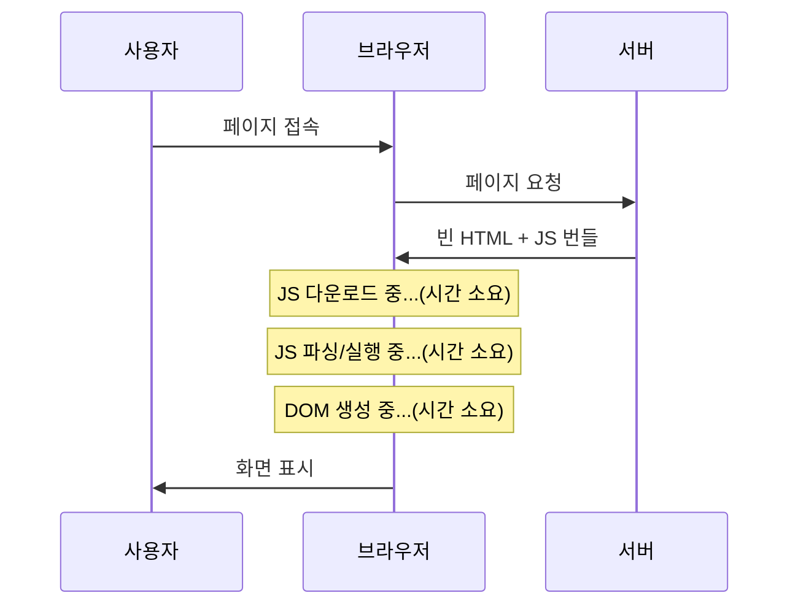
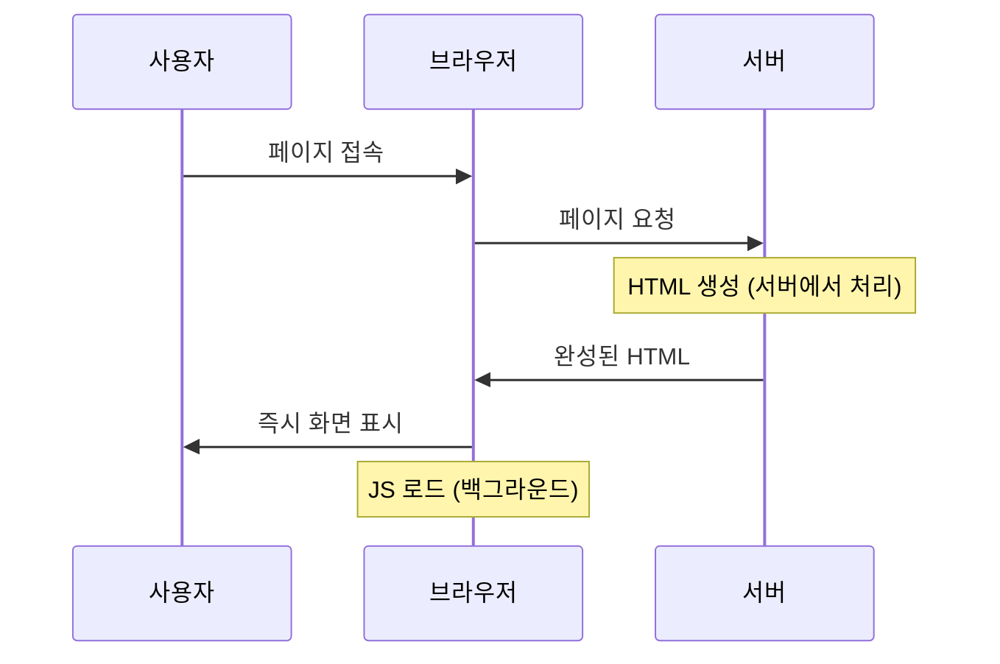
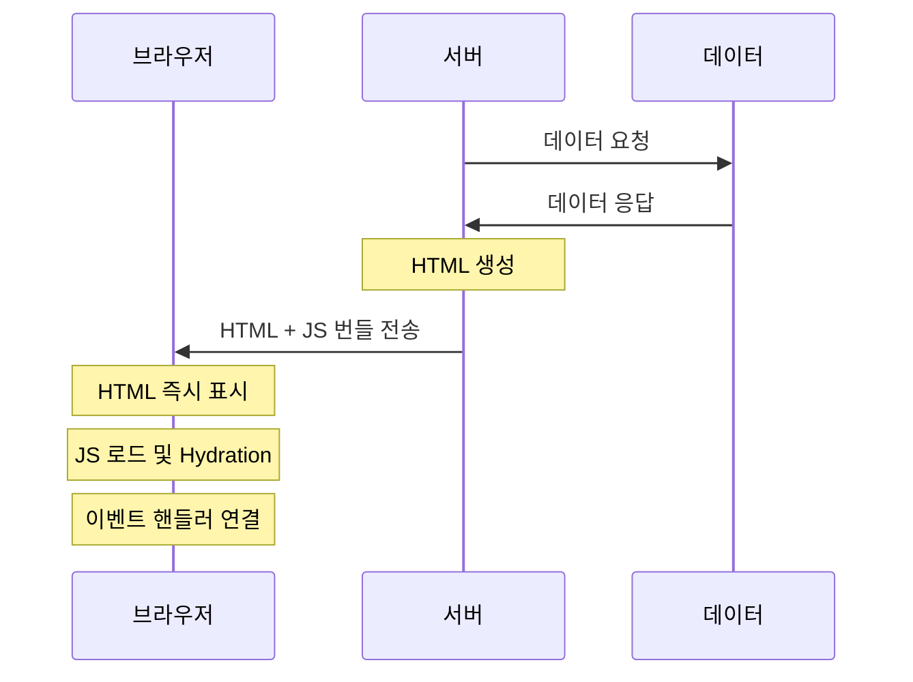

# React from Scratch 구현하기

## 주차별 학습 내용

### 1주차: VirtualDOM & Renderer
- 참고 자료: [Let's build a React from scratch: Part 1 — VirtualDOM and Renderer](https://geekpaul.medium.com/lets-build-a-react-from-scratch-part-1-virtualdom-and-renderer-14f4f716de62)

#### 개발 환경 설정
1. 프로젝트 초기화
```bash
npm init -y                  # package.json 생성
npm install -D typescript    # TypeScript 설치
npx tsc --init              # tsconfig.json 생성 (자료에서는 npx typescript --init 이라고 되어있지만 실제로는 npx tsc --init를 해야함)
```

2. TypeScript 설정 (`tsconfig.json`)
- JSX 지원을 위한 설정: `"jsx": "react"` 
- 타입 체크 완화: `"strict": false`
- 추가 설정:
  ```json
  {
    "outDir": "./dist",     # 컴파일된 파일이 저장될 위치지정
    "rootDir": "./src"      # TypeScript 소스 파일 위치지정정
  }
  ```

#### Scripts (package.json)
```json
{
  "scripts": {
    "dev": "tsc -w",        # TypeScript 컴파일러 watch 모드
    "serve": "npx serve ."  # 로컬 웹 서버 실행
  }
}
```


3. 개발 서버 설정
```bash
npm install -D serve         # 로컬 웹 서버 설치
```

#### 실행 방법
두 개의 터미널이 필요합니다:

1. TypeScript 컴파일러 실행 (첫 번째 터미널)
```bash
npm run dev
```

2. 웹 서버 실행 (두 번째 터미널)
```bash
npm run serve
```

#### React 핵심 개념: ReactElement vs ReactComponent

##### ReactElement
- HTML 태그를 직접 사용하는 기본적인 JSX 구조
- 예시:
  ```jsx
  const App = (
    <div>
      <h2>Hello React!</h2>
      <p>I am a paragraph</p>
    </div>
  );
  ```
- 특징:
  - 단순한 HTML 구조 표현
  - 정적인 콘텐츠
  - 재사용이 어려움

##### ReactComponent
- props를 입력받아 ReactElement를 반환하는 함수
- 예시:
  ```jsx
  const Title = (props) => (
    <h2>안녕하세요 {props.name}!</h2>
  );

  const App = (
    <div>
      <Title name="React" />
      <p>나는 단락이에요</p>
    </div>
  );
  ```
- 특징:
  - 재사용 가능한 UI 조각
  - props를 통한 동적 데이터 처리
  - 로직과 UI의 캡슐화
  - 컴포넌트 기반 개발의 기초

##### ReactElement와 ReactComponent 비교
| 특성 | ReactElement | ReactComponent |
|------|--------------|----------------|
| 형태 | 일반 객체 | 함수 |
| 생성 방식 | JSX → createElement 호출 | 함수 정의 |
| 입력 | 없음 | props |
| 재사용성 | 낮음 | 높음 |
| 동적 데이터 | 직접 값 사용 | props를 통해 전달 |
| 로직 포함 | 불가능 | 가능 |
| 예시 코드 | `<div>Hello</div>` | `<Title name="React" />` |

#### Virtual DOM 렌더링 과정
Virtual DOM을 실제 DOM으로 변환하는 과정을 구현

#### 1주차 소감
Rect의 virtual Dom의 렌더링 원리를 깊이 있게 알수 있어서 좋았어요.
특히 주로 만들어진 프레임워크나 라이브러리를 활용하는데 초점을 두는 편이라 어떻게 만들어진걸까. 작동원리를 깊게 생각하지 않는 편인데 리액트도 그렇지만 다른 라이브러리/프레임워크도 깊게 파면 재미있겠다는 생각이 들었어요.

### 2주차: State Management & Hooks
- 참고 자료: https://geekpaul.medium.com/lets-build-a-react-from-scratch-part-2-state-management-and-react-hooks-e771c5c06066

#### useState로 여러 상태 관리하기

React의 useState 훅이 여러 상태를 관리하는 방식을 이해하기:

##### 시각적 구조


##### 이미지 설명
위 다이어그램은 React의 useState가 여러 상태를 관리하는 방식을 보여줍니다:

1. **State Array (상태 배열)**
   - 이미지에서 가장 위에 있는 긴 상자가 상태 배열을 나타냅니다
   - 각각의 칸은 서로 다른 상태값을 저장하는 공간입니다
   - 예: name 상태는 첫 번째 칸, count 상태는 두 번째 칸에 저장

2. **State Cursor (상태 커서)**
   - 다이어그램 중앙의 포인터가 상태 커서입니다
   - useState가 호출될 때마다 이 커서가 이동하면서:
     - 첫 번째 useState는 배열의 첫 번째 위치 사용
     - 두 번째 useState는 배열의 두 번째 위치 사용
   - 이를 통해 각 상태가 자신만의 고유한 저장 공간을 가집니다

##### 기술적 구현
```javascript
// 전역 상태 관리
const myAppState = [];    // State Array
let myAppStateCursor = 0; // State Cursor

function App() {
  // 첫 번째 useState는 myAppState[0]을 사용
  const [name, setName] = useState('John');
  
  // 두 번째 useState는 myAppState[1]을 사용
  const [count, setCount] = useState(0);
}
```

##### 작동 방식
1. **초기 렌더링 시**:
   - `useState('John')` 호출: `myAppState[0]`에 'John' 저장
   - `useState(0)` 호출: `myAppState[1]`에 0 저장
   - 각 호출 후 커서가 다음 위치로 이동

2. **리렌더링 시**:
   - 커서는 다시 0으로 초기화
   - useState 호출들이 같은 순서로 실행
   - 각 상태는 배열의 동일한 위치에서 자신의 값을 찾음

##### 장점
- 각 상태가 독립적으로 관리됨
- 상태들이 서로 덮어쓰지 않음
- 컴포넌트 리렌더링 시에도 각 상태의 값이 보존됨
- 상태 관리가 예측 가능하고 안정적임

이러한 방식으로 React는 여러 개의 useState를 사용하더라도 각각의 상태를 올바르게 추적하고 관리할 수 있습니다.

#### render 함수
render 함수에서 텍스트 노드 처리 방식 이해하기:

##### 텍스트 노드 처리 문제
초기 구현에서는 문자열만 처리할 수 있었습니다:
```javascript
if (typeof el === 'string') {  // 문자열만 체크
  domEl = document.createTextNode(el);
  container.appendChild(domEl);
  return;
}
```

이로 인해 숫자 타입의 상태(예: count)를 표시할 때 두 가지 해결 방법이 필요했습니다:

1. **컴포넌트에서 toString() 사용**
   ```javascript
   <h2>카운터 값: {count.toString()}</h2>
   ```

2. **render 함수 수정**
   ```javascript
   if (typeof el === 'string' || typeof el === 'number') {  // 숫자도 처리
     domEl = document.createTextNode(el.toString());
     container.appendChild(domEl);
     return;
   }
   ```

두 번째 방법이 더 좋은 이유:
- 컴포넌트 코드를 더 깔끔하게 유지할 수 있음
- 실제 React의 동작 방식과 유사함
- 모든 primitive 값을 자동으로 문자열로 변환

#### 2주차 소감
useState가 상태관리를 하기 위한 함수인건 알고 있었는데. 해당 함수가 이런식으로 작동하고 있다는건 처음 알게되었습니다.
상당히 인상적이었어요.

### 3주차: React Suspense & Concurrent Mode
- 참고 자료: [Let's build a React from scratch: Part 3— React Suspense and Concurrent Mode](https://geekpaul.medium.com/lets-build-a-react-from-scratch-part-3-react-suspense-and-concurrent-mode-5da8c12aed3f)

#### React 18의 핵심 기능
1. Concurrent(동시성) 모드
   - React의 핵심 렌더링 모델을 근본적으로 업데이트한 기능
   - 렌더링이 중단 가능(interruptible)한 특징을 가짐
   - React가 렌더링 작업의 우선순위를 조절하고, 필요한 경우 진행 중인 렌더링을 중단하고 더 중요한 업데이트를 처리 가능

2. React Suspense
   - 비동기 작업(예: 데이터 페칭)을 React의 렌더링 사이클 내에서 처리할 수 있게 해주는 메커니즘
   - 데이터 페칭 접근 방식:
     1) Fetch-on-Render: 컴포넌트가 렌더링된 후 데이터를 가져옴
     2) Fetch-then-Render: 모든 데이터를 가져온 후 렌더링
     3) Render-as-you-Fetch: Suspense를 사용한 방식으로, 데이터를 가져오는 동시에 렌더링을 시작

#### Suspense의 주요 장점
- 비동기 작업을 더 선언적으로 처리
- 로딩 상태를 더 우아하게 처리
- 워터폴(waterfall) 현상 방지

#### React 렌더링 기술
첫 번째 섹션에서는 VirtualDOM을 가져와 브라우저에 렌더링하는 방법에 대해 설명했습니다. 하지만 때로는(대부분의 경우) 원격 API에서 데이터를 가져와서 DOM에 렌더링해야 할 수도 있습니다. React에는 일반적으로 세 가지 기본 렌더링 기법이 있음.

1. 렌더링 시 가져오기(Fetch-on-Render, Suspense 사용하지 않음)
   - 가장 전통적인 접근 방식으로, 초기 렌더링 후 데이터를 가져오는 작업을 관리
   - 데이터가 준비되면 React의 States를 사용하여 데이터를 채움
   - 컴포넌트가 화면에 렌더링된 후에야 데이터 가져오기를 시작
   - 종속 데이터가 있는 경우 "워터폴(waterfall)" 문제 발생: 한 번에 한 레이어씩 순차적으로 처리
   
   타임라인:
   1. 컴포넌트 마운트
   2. 첫 번째 데이터 요청 시작
   3. 첫 번째 데이터 로딩 UI 표시
   4. 첫 번째 데이터 도착
   5. 컴포넌트 리렌더링
   6. 두 번째 데이터 요청 시작
   7. 두 번째 데이터 로딩 UI 표시
   8. 두 번째 데이터 도착
   9. 최종 렌더링

   한계:
   - 각 데이터 요청이 순차적으로 발생하여 전체 로딩 시간 증가
   - 불필요한 리렌더링 발생
   - 데이터 의존성이 깊어질수록 성능 저하

2. 가져온 후 렌더링(Fetch-then-Render, Suspense 사용하지 않음)
   - 데이터 가져오기를 중앙화된 방식으로 처리하여 워터폴 현상 방지
   - 모든 데이터를 한 번에 가져온 후 setState를 통해 렌더링 프로세스 트리거
   - Promise.all을 사용하여 여러 데이터를 동시에 가져올 수 있음

   타임라인:
   1. 모든 데이터 동시 요청 시작
   2. 로딩 UI 표시
   3. 모든 데이터 도착
   4. 한 번의 리렌더링으로 완료

   한계:
   - 가장 느린 데이터 요청만큼 전체가 대기
   - 부분적 UI 업데이트 불가능
   - 모든 데이터가 준비될 때까지 렌더링 시작 불가

3. Suspense를 사용한 가져오기 시 렌더링(Render-as-you-Fetch)
   - 기존: 가져오기 시작 → 가져오기 완료 → 렌더링 시작
   - Suspense: 가져오기 시작 → 렌더링 시작 → 가져오기 완료
   - 네트워크 요청 시작 직후부터 렌더링 시작 가능
   - 데이터 페칭 최적화를 위한 추가 작업 불필요
   - 데이터, 이미지, 페이지, 문서 등 모든 리소스를 논블로킹 방식으로 처리

   타임라인:
   1. 모든 데이터 요청 시작
   2. 즉시 렌더링 시작
   3. 준비된 컴포넌트부터 순차적 표시
   4. 각 데이터 도착 시 해당 부분만 업데이트
   5. 점진적 UI 완성

   장점:
   - 데이터 로딩과 렌더링 병렬 처리
   - 부분적 UI 업데이트 가능
   - 사용자 경험 향상
   - 더 빠른 초기 렌더링

#### React Suspense 작동 방식
- React 렌더링 사이클에서 비동기 호출(Promise)을 처리하는 메커니즘
- 기존 React 렌더링은 동기적 단계였으나, Suspense를 통해 비동기 처리 가능
- VirtualDOM 내 어디서든 Promise를 처리할 수 있게 해주며, 로딩 상태를 fallback UI로 표시
- 진행 중인 모든 Promise를 추적하고, 해결 시 자동으로 VirtualDOM을 업데이트하고 렌더링

Suspense의 철학:
- 애플리케이션 개발자가 리소스 로딩과 상태 관리에 대해 걱정하지 않도록 함
- 라이브러리가 복잡한 비동기 처리와 UI 업데이트를 담당
- 개발자는 비즈니스 로직에만 집중할 수 있음
- "도구가 복잡성을 처리하고, 개발자는 창의성을 발휘한다"는 React의 철학을 반영

구체적인 작동 방식:
1. Promise 감지 및 처리
   ```javascript
   try {
     return tag(props, ...children);
   } catch ({ promise, key }) {
     // Promise가 던져지면 캐치
     promise.then((value) => {
       resourceCache[key] = value; // 캐시에 저장
       reRender();  // 다시 렌더링
     });
     return fallbackUI; // 임시 UI 표시
   }
   ```
2. 데이터 흐름
   - 비동기 데이터 요청 발생
   - Promise를 던져서(throw) Suspense에 알림
   - Suspense가 Promise를 캐치하여 fallback UI 표시
   - 데이터 준비되면 자동으로 실제 컴포넌트로 교체

#### Concurrent 모드란?
- React의 렌더링 모델을 근본적으로 업데이트한 기능
- 렌더링 작업을 중단 가능(interruptible)하게 만듦
- 우선순위 기반 렌더링 지원

주요 특징:
1. 렌더링 중단 및 재개
   - 더 중요한 작업이 있으면 현재 렌더링을 일시 중지
   - 우선순위가 높은 업데이트(사용자 입력 등) 먼저 처리
   - 중단된 작업은 나중에 재개 가능

2. 작업 우선순위 관리
   ```javascript
   // 우선순위 예시
   긴급 업데이트: 사용자 입력, 애니메이션
   일반 업데이트: API 데이터 표시
   낮은 우선순위: 오프스크린 콘텐츠 렌더링
   ```

3. 사용자 경험 개선
   - 화면 끊김 현상 감소
   - 부드러운 인터랙션 제공
   - 복잡한 업데이트도 자연스럽게 처리

주의사항:
- 로우 레벨 구현 세부사항에 의존하지 않기
- React 팀이 권장하는 방식으로만 사용
- Suspense와 함께 사용할 때 가장 효과적

#### Suspense와 Concurrent Mode의 한계점
현재 구현의 주요 한계점은 여러 리소스를 로드할 때 발생합니다. 예외가 발생하는 즉시 기존 VirtualDOM 렌더링을 폐기하고 폴백을 표시하는 방식은 다소 비생산적입니다. 

예를 들어, 여러 이미지를 로드하는 경우:
```jsx
const App = () => {
  const photo1 = createResource(getMyAwesomePic, 'photo1');
  const photo2 = createResource(getMyAwesomePic, 'photo2');
  
  return (
    <div>
      
      
    </div>
  );
};
```

이 경우 다음과 같은 순차적 처리가 발생합니다:
1. photo1 로드 시작 → 폴백 UI 표시
2. photo1 로드 완료 → 리렌더링
3. photo2 로드 시작 → 다시 폴백 UI 표시
4. photo2 로드 완료 → 최종 리렌더링

이상적으로는 두 리소스를 병렬로 로드하면서도 모든 리소스가 준비될 때까지 기다렸다가 한 번에 렌더링하는 것이 더 효율적일 것입니다.

##### 현재 구현의 순차적 처리 방식


##### 개선된 병렬 처리 방식


이러한 개선을 통해 얻을 수 있는 이점:
1. 전체 로딩 시간이 절반으로 줄어듦 (3초 → 1.5초)
2. 사용자는 로딩 UI를 한 번만 보게 됨
3. 모든 컨텐츠가 준비되면 한 번에 깔끔하게 표시됨

이것이 바로 Suspense의 "Render-as-You-Fetch" 패턴이 추구하는 방향이며, React 18에서 강조하는 동시성(Concurrent) 렌더링의 핵심 개념.

저자가 말한 비효율적인 부분과 그 해결 방식식

#### 3주차 소감
React의 렌더링 방법에 대해 깊게 알게 된게 가장 큰 소득 같아요.
SPA의 경우에는 어떻게 렌더링 하느냐가 상당히 중요한걸로 아는데.
이부분을 깊게 알게 된점이 매우 큰 소득이에요.
특히 비동기 데이터를 처리할 때, Fetch-on-Render처럼 순차적으로 데이터를 가져와서 렌더링하는 방식과 
Suspense를 활용해 모든 데이터를 병렬로 가져오면서 한번에 렌더링하는 방식의 차이,
그리고 각 방식이 어떤 상황에서 더 효율적일 수 있는지 이해하게 된 것이 가장 큰 소득이었어요.

### 4주차: Server Side Rendering (SSR)
- 참고 자료: [Let's build a React from scratch: Part 4— Server Side Rendering and its Challenges](https://geekpaul.medium.com/lets-build-a-react-from-scratch-part-4-server-side-rendering-and-its-challenges-b7b87c84bbf)

#### SSR(Server Side Rendering)의 이해

##### 클라이언트 사이드 렌더링 (CSR)


##### 서버 사이드 렌더링 (SSR)


##### CSR vs SSR 비교
| 특성 | CSR (Client Side Rendering) | SSR (Server Side Rendering) |
|------|---------------------------|---------------------------|
| HTML 생성 위치 | 브라우저 | 서버 |
| 초기 로딩 | JS 다운로드/파싱 후 | 즉시 표시 |
| 서버 부하 | 낮음 | 높음 |
| SEO | 상대적으로 불리 | 유리 |
| 사용자 경험 | 초기 로딩 후 빠른 전환 | 빠른 초기 로딩 |

##### SSR의 장점
1. **빠른 초기 로딩**
   - JavaScript 파싱/실행을 기다리지 않고 즉시 콘텐츠 표시
   - 사용자가 빠르게 콘텐츠를 볼 수 있음

2. **향상된 SEO**
   - 검색 엔진 크롤러가 완성된 HTML을 바로 분석 가능
   - 더 나은 검색 엔진 색인화

##### SSR의 주의점
- 서버 부하 증가
- 트래픽 증가에 따른 서버 성능 요구사항 증가
- 적절한 캐싱과 성능 최적화 필요

##### CSR vs SSR 상세 비교

###### 클라이언트 사이드 렌더링(CSR)의 과정:


1. 브라우저가 서버에 요청
2. 서버는 빈 HTML과 JavaScript 번들을 전송
3. 브라우저가 JavaScript를 다운로드
4. JavaScript를 파싱하고 실행
5. JavaScript가 DOM을 생성하고 화면에 렌더링

###### 서버 사이드 렌더링(SSR)의 과정:


1. 브라우저가 서버에 요청
2. 서버가 HTML을 미리 생성
3. 서버가 완성된 HTML을 브라우저로 전송
4. 브라우저가 HTML을 즉시 표시
5. 그 후 JavaScript를 로드하여 이벤트 핸들러 등을 연결(hydration)

##### 주요 차이점
1. **초기 로딩 시간**
   - CSR: JS 다운로드 + 파싱 + 실행 시간이 필요
   - SSR: HTML을 받자마자 바로 표시 가능

2. **서버 부하**
   - CSR: 서버는 단순히 파일만 전송
   - SSR: 서버가 HTML 생성 작업을 수행

3. **사용자 경험**
   - CSR: 초기 로딩은 느리지만, 이후 페이지 전환이 빠름
   - SSR: 초기 콘텐츠를 빠르게 볼 수 있음

SSR이 "First Contentful Paint" (첫 콘텐츠가 표시되는 시간)에서 유리한 이유는 JavaScript의 다운로드, 파싱, 실행 과정이 필요 없기 때문입니다. 이는 특히 다음과 같은 상황에서 더 큰 장점이 됩니다:
- 느린 네트워크 환경
- 성능이 낮은 기기
- 초기 로딩 속도가 중요한 경우
- SEO가 중요한 경우

#### SSR의 작동 방식: Hydration


##### Hydration의 이점
1. **성능 최적화**
   - 빠른 초기 페이지 로드
   - 점진적인 JavaScript 기능 활성화
   - 사용자 경험 향상

2. **리소스 효율성**
   - 서버 자원 효율적 사용
   - 클라이언트 부하 분산
   - 네트워크 트래픽 최적화

##### BrowserRouter와 History API를 활용한 SPA 구현
React Router의 BrowserRouter는 브라우저의 History API를 활용하여 클라이언트 사이드 라우팅을 구현합니다.

1. **History API의 역할**
   ```javascript
   // History API 예시
   window.history.pushState({}, '', '/about');  // URL 변경
   window.history.back();                       // 뒤로 가기
   window.history.forward();                    // 앞으로 가기
   ```
   - 브라우저의 세션 기록(방문 이력) 조작
   - URL 변경 시 페이지 새로고침 방지
   - 브라우저 네비게이션(뒤로 가기/앞으로 가기) 지원

2. **BrowserRouter의 동작 방식**
   ```jsx
   // 클라이언트 측 라우팅 설정
   <BrowserRouter>
     <Routes>
       <Route path="/" element={<Home />} />
       <Route path="/about" element={<About />} />
     </Routes>
   </BrowserRouter>
   ```
   - Link 클릭 → History API로 URL 변경
   - URL 변경 감지 → 해당 컴포넌트 렌더링
   - 페이지 상태 유지 (새로고침 없음)

3. **SSR과의 통합**
   ```jsx
   // 서버 측
   <StaticRouter location={req.url}>
     <App />
   </StaticRouter>

   // 클라이언트 측
   hydrateRoot(
     document.getElementById('root')!,
     <BrowserRouter>
       <App />
     </BrowserRouter>
   );
   ```
   - 서버: StaticRouter로 초기 HTML 생성
   - 클라이언트: BrowserRouter로 이벤트 처리
   - Hydration 후 완전한 SPA 동작

4. **장점**
   - 부드러운 페이지 전환
   - 서버 부하 감소 (필요한 데이터만 요청)
   - 앱과 같은 사용자 경험
   - 브라우저 히스토리 완벽 지원

이러한 방식으로 SSR의 빠른 초기 로딩과 SPA의 동적인 페이지 전환을 모두 활용할 수 있습니다.

#### SSR을 위한 앱 설치 과정

##### 1. 필요한 패키지 설치
```bash
# 기본 의존성 설치
npm install express react react-dom react-router-dom

# 개발 의존성 설치
npm install --save-dev webpack webpack-cli webpack-dev-server babel-loader @babel/core @babel/preset-react @babel/preset-env html-webpack-plugin
```

##### 2. 서버 설정 (server.js)
```javascript
const express = require('express');
const path = require('path');

const app = express();
const PORT = process.env.PORT || 3000;

// 정적 파일 제공
app.use(express.static(path.join(__dirname, 'dist')));

// 모든 요청을 index.html로 라우팅
app.get('*', (req, res) => {
  res.sendFile(path.join(__dirname, 'dist', 'index.html'));
});

app.listen(PORT, () => {
  console.log(`Server is running on port ${PORT}`);
});
```

##### 3. Webpack 설정 (webpack.config.js)
```javascript
const path = require('path');
const HtmlWebpackPlugin = require('html-webpack-plugin');

module.exports = {
  mode: 'development',
  entry: './src/index.js',
  output: {
    path: path.resolve(__dirname, 'dist'),
    filename: 'bundle.js',
    publicPath: '/',
  },
  module: {
    rules: [
      {
        test: /\.(js|jsx|ts|tsx)$/,
        exclude: /node_modules/,
        use: {
          loader: 'babel-loader',
          options: {
            presets: ['@babel/preset-env', '@babel/preset-react']
          }
        }
      }
    ]
  },
  resolve: {
    extensions: ['.js', '.jsx', '.ts', '.tsx']
  },
  plugins: [
    new HtmlWebpackPlugin({
      template: './index.html'
    })
  ],
  devServer: {
    historyApiFallback: true,
    port: 3000,
    hot: true
  }
};
```

##### 4. HTML 템플릿 (index.html)
```html
<!DOCTYPE html>
<html lang="ko">
<head>
    <meta charset="UTF-8">
    <meta name="viewport" content="width=device-width, initial-scale=1.0">
    <title>React SSR Study</title>
</head>
<body>
    <div id="root"></div>
</body>
</html>
```

##### 5. React 진입점 (src/index.js)
```javascript
import React from 'react';
import ReactDOM from 'react-dom/client';
import { BrowserRouter } from 'react-router-dom';
import App from './App';

const root = ReactDOM.createRoot(document.getElementById('root'));

root.render(
  <React.StrictMode>
    <BrowserRouter>
      <App />
    </BrowserRouter>
  </React.StrictMode>
);
```

##### 6. 스크립트 설정 (package.json)
```json
{
  "scripts": {
    "start": "node server.js",
    "dev": "webpack serve --mode development --open",
    "build": "webpack --mode production"
  },
  "dependencies": {
    "express": "^4.18.3",
    "react": "^19.1.0",
    "react-dom": "^19.1.0",
    "react-router-dom": "^6.22.3"
  },
  "devDependencies": {
    "@babel/core": "^7.24.0",
    "@babel/preset-env": "^7.24.0",
    "@babel/preset-react": "^7.23.3",
    "babel-loader": "^9.1.3",
    "html-webpack-plugin": "^5.6.0",
    "webpack": "^5.90.3",
    "webpack-cli": "^5.1.4",
    "webpack-dev-server": "^5.0.2"
  }
}
```

##### 프로젝트 구조
```
study-react-from-scratch-hoco/
├── src/
│   └── index.js
├── index.html
├── server.js
├── webpack.config.js
├── package.json
└── package-lock.json
```

##### 설정 설명
1. **서버 설정 (server.js)**
   - Express 서버를 사용하여 정적 파일 제공
   - 모든 라우트를 index.html로 리다이렉트 (SPA 지원)
   - 기본 포트 3000 사용

2. **Webpack 설정 (webpack.config.js)**
   - JavaScript/TypeScript 파일 처리를 위한 바벨 설정
   - HMR(Hot Module Replacement) 지원
   - HTML 템플릿 플러그인 사용
   - 개발 서버 설정

3. **앱 실행 방법**
   ```bash
   # 개발 모드 실행
   npm run dev

   # 프로덕션 빌드
   npm run build

   # 서버 실행
   npm start
   ```

이 설정은 React 앱의 SSR을 위한 기본적인 환경을 제공합니다. 다음 단계에서는 실제 SSR 구현과 Hydration 과정을 다룰 예정입니다.

#### SSR 관련 파일 상세 설명 - package.json 주요 변경사항
- **스크립트 명령어**
  - `start`: Express 서버 실행
  - `dev`: 웹팩 개발 서버 실행 (HMR 지원)
  - `build`: 프로덕션용 빌드 생성

- **새로운 의존성**
  - `express`: SSR을 위한 서버
  - `react-router-dom`: 클라이언트/서버 라우팅
  - 웹팩 관련: 빌드 도구 체인
  - 바벨 관련: JSX 및 최신 JavaScript 지원

##### 주요 변경사항 요약
1. **서버 측 변경**
   - Express 서버 추가로 SSR 지원
   - 정적 파일 서빙 및 SPA 라우팅 처리

2. **클라이언트 측 변경**
   - React 18 기능 활용
   - 클라이언트 사이드 라우팅 설정
   - 웹팩 기반 빌드 시스템 구축

3. **개발 환경 개선**
   - HMR을 통한 빠른 개발 가능
   - 프로덕션 빌드 최적화
   - TypeScript 지원 추가

이러한 변경사항들은 모던 React 애플리케이션의 SSR 구현을 위한 기본 토대를 제공합니다. 다음 단계에서는 이 설정을 기반으로 실제 SSR 로직을 구현할 예정입니다.

### React SSR 구현 방식과 권장사항

이번 학습에서는 `react-dom/server`를 사용하여 직접 SSR을 구현해보았지만, 실제 프로덕션 환경에서는 이 방식이 권장되지 않습니다.

#### React의 기본 렌더링 방식
React는 기본적으로 클라이언트 사이드 렌더링(CSR) 라이브러리입니다. React 팀은 SSR이 필요한 경우 다음과 같은 프레임워크 사용을 권장합니다:

- Next.js
- Remix
- Gatsby

#### 프레임워크 사용을 권장하는 이유

1. **복잡성 관리**
   - SSR 구현에는 많은 엣지 케이스와 고려사항이 존재
   - 데이터 페칭, 상태 관리, 라우팅 등 복잡한 문제들을 프레임워크가 해결
   - 직접 구현 시 발생할 수 있는 성능, 보안 이슈 예방

2. **최적화된 기능**
   - 자동 코드 분할 (Code Splitting)
   - 이미지 최적화
   - 성능 최적화
   - 개발 환경 설정

3. **유지보수**
   - 프레임워크 팀의 지속적인 업데이트와 버그 수정
   - 커뮤니티 지원
   - 검증된 솔루션 사용

4. **개발 생산성**
   - 미리 구축된 기능들로 빠른 개발 가능
   - 표준화된 프로젝트 구조
   - 명확한 베스트 프랙티스

따라서 실제 프로젝트에서 SSR이 필요한 경우, Next.js와 같은 프레임워크를 사용하는 것이 더 안전하고 효율적인 선택이 될 수 있습니다.

// ... existing code ...

#### SSR에 대해 좀 더 심도있게 다루기

##### 1. SSR에서의 데이터 로딩 과제 (useEffect 훅 사전 로딩)

###### 문제점
일반적인 React(CSR)에서는 데이터 로딩을 다음과 같이 처리합니다:
```javascript
const Component = () => {
  const [data, setData] = useState(null);
  
  useEffect(() => {
    // 컴포넌트 마운트 후 데이터 로딩
    fetch('/api/data').then(data => setData(data));
  }, []);

  return <div>{data ? data : "로딩 중..."}</div>;
}
```
하지만 SSR에서는 useEffect가 서버에서 실행되지 않기 때문에 (서버에는 라이프사이클이 없음), 초기 HTML에는 항상 "로딩 중..." 상태만 포함됩니다.

###### 해결 방법
서버에서 미리 데이터를 가져와 HTML에 포함시키는 방식을 사용합니다:

1. **서버 사이드 렌더링 시:**
```javascript
// 서버 코드
async function render() {
  // 1. 데이터를 미리 가져옴
  const data = await fetchData();
  
  // 2. 데이터를 전역 객체에 포함할 스크립트 생성
  const dataScript = `
    <script>
      window.__INITIAL_DATA__ = ${JSON.stringify(data)};
    </script>
  `;
  
  // 3. React 컴포넌트 렌더링
  const html = ReactDOMServer.renderToString(<App />);
  
  return { html, dataScript };
}
```

2. **클라이언트 사이드 컴포넌트:**
```javascript
const Component = () => {
  // 4. 서버에서 주입한 데이터를 초기값으로 사용
  const initialData = window.__INITIAL_DATA__ || null;
  const [data, setData] = useState(initialData);

  useEffect(() => {
    // 5. 서버 데이터가 없을 때만 fetch
    if (!initialData) {
      fetchData().then(data => setData(data));
    }
  }, [initialData]);

  return <div>{data}</div>;
}
```

###### 장점
1. 초기 페이지 로드 시 데이터가 이미 포함되어 있음
2. 로딩 상태를 보여주지 않아도 됨
3. 불필요한 API 호출 방지

###### Next.js의 해결방식
Next.js는 이 문제를 `getServerSideProps`라는 특별한 함수로 해결합니다:
```javascript
// pages/index.js
export async function getServerSideProps() {
  const data = await fetchData();
  return { props: { data } };
}

export default function Page({ data }) {
  // 데이터가 이미 props로 전달됨
  return <div>{data}</div>;
}
```

##### 2. 중첩/종속 데이터 로딩 (멀티 패스 렌더링)
데이터가 계층적으로 의존성을 가질 때 발생하는 문제입니다. 예를 들어, 사용자 정보를 먼저 가져와야 그 사용자의 게시물을 가져올 수 있는 경우입니다. 이는 다음 섹션에서 자세히 다루겠습니다.

##### 3. React 18의 스트리밍 하이드레이션
React 18에서 도입된 Suspense를 사용한 스트리밍 SSR 기능에 대해 다룹니다. 이는 추후 구현 예정입니다.

##### 4. SSR에서 전역 객체 다루기
브라우저 전역 객체 사용 시 발생하는 문제와 해결 방법에 대해 다룹니다. 이는 추후 구현 예정입니다.

