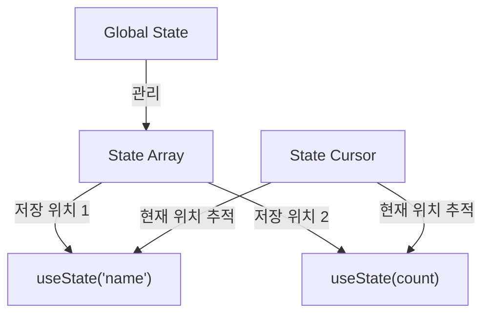

# React from Scratch 구현하기

## 주차별 학습 내용

### 1주차: VirtualDOM & Renderer
- 참고 자료: [Let's build a React from scratch: Part 1 — VirtualDOM and Renderer](https://geekpaul.medium.com/lets-build-a-react-from-scratch-part-1-virtualdom-and-renderer-14f4f716de62)

#### 개발 환경 설정
1. 프로젝트 초기화
```bash
npm init -y                  # package.json 생성
npm install -D typescript    # TypeScript 설치
npx tsc --init              # tsconfig.json 생성 (자료에서는 npx typescript --init 이라고 되어있지만 실제로는 npx tsc --init를 해야함)
```

2. TypeScript 설정 (`tsconfig.json`)
- JSX 지원을 위한 설정: `"jsx": "react"` 
- 타입 체크 완화: `"strict": false`
- 추가 설정:
  ```json
  {
    "outDir": "./dist",     # 컴파일된 파일이 저장될 위치지정
    "rootDir": "./src"      # TypeScript 소스 파일 위치지정정
  }
  ```

#### Scripts (package.json)
```json
{
  "scripts": {
    "dev": "tsc -w",        # TypeScript 컴파일러 watch 모드
    "serve": "npx serve ."  # 로컬 웹 서버 실행
  }
}
```


3. 개발 서버 설정
```bash
npm install -D serve         # 로컬 웹 서버 설치
```

#### 실행 방법
두 개의 터미널이 필요합니다:

1. TypeScript 컴파일러 실행 (첫 번째 터미널)
```bash
npm run dev
```

2. 웹 서버 실행 (두 번째 터미널)
```bash
npm run serve
```

#### React 핵심 개념: ReactElement vs ReactComponent

##### ReactElement
- HTML 태그를 직접 사용하는 기본적인 JSX 구조
- 예시:
  ```jsx
  const App = (
    <div>
      <h2>Hello React!</h2>
      <p>I am a paragraph</p>
    </div>
  );
  ```
- 특징:
  - 단순한 HTML 구조 표현
  - 정적인 콘텐츠
  - 재사용이 어려움

##### ReactComponent
- props를 입력받아 ReactElement를 반환하는 함수
- 예시:
  ```jsx
  const Title = (props) => (
    <h2>안녕하세요 {props.name}!</h2>
  );

  const App = (
    <div>
      <Title name="React" />
      <p>나는 단락이에요</p>
    </div>
  );
  ```
- 특징:
  - 재사용 가능한 UI 조각
  - props를 통한 동적 데이터 처리
  - 로직과 UI의 캡슐화
  - 컴포넌트 기반 개발의 기초

##### ReactElement와 ReactComponent 비교
| 특성 | ReactElement | ReactComponent |
|------|--------------|----------------|
| 형태 | 일반 객체 | 함수 |
| 생성 방식 | JSX → createElement 호출 | 함수 정의 |
| 입력 | 없음 | props |
| 재사용성 | 낮음 | 높음 |
| 동적 데이터 | 직접 값 사용 | props를 통해 전달 |
| 로직 포함 | 불가능 | 가능 |
| 예시 코드 | `<div>Hello</div>` | `<Title name="React" />` |

#### Virtual DOM 렌더링 과정
Virtual DOM을 실제 DOM으로 변환하는 과정을 구현

#### 1주차 소감
Rect의 virtual Dom의 렌더링 원리를 깊이 있게 알수 있어서 좋았어요.
특히 주로 만들어진 프레임워크나 라이브러리를 활용하는데 초점을 두는 편이라 어떻게 만들어진걸까. 작동원리를 깊게 생각하지 않는 편인데 리액트도 그렇지만 다른 라이브러리/프레임워크도 깊게 파면 재미있겠다는 생각이 들었어요.

### 2주차: State Management & Hooks
- 참고 자료: https://geekpaul.medium.com/lets-build-a-react-from-scratch-part-2-state-management-and-react-hooks-e771c5c06066

#### useState로 여러 상태 관리하기

React의 useState 훅이 여러 상태를 관리하는 방식을 이해하기:

##### 시각적 구조


##### 이미지 설명
위 다이어그램은 React의 useState가 여러 상태를 관리하는 방식을 보여줍니다:

1. **State Array (상태 배열)**
   - 이미지에서 가장 위에 있는 긴 상자가 상태 배열을 나타냅니다
   - 각각의 칸은 서로 다른 상태값을 저장하는 공간입니다
   - 예: name 상태는 첫 번째 칸, count 상태는 두 번째 칸에 저장

2. **State Cursor (상태 커서)**
   - 다이어그램 중앙의 포인터가 상태 커서입니다
   - useState가 호출될 때마다 이 커서가 이동하면서:
     - 첫 번째 useState는 배열의 첫 번째 위치 사용
     - 두 번째 useState는 배열의 두 번째 위치 사용
   - 이를 통해 각 상태가 자신만의 고유한 저장 공간을 가집니다

##### 기술적 구현
```javascript
// 전역 상태 관리
const myAppState = [];    // State Array
let myAppStateCursor = 0; // State Cursor

function App() {
  // 첫 번째 useState는 myAppState[0]을 사용
  const [name, setName] = useState('John');
  
  // 두 번째 useState는 myAppState[1]을 사용
  const [count, setCount] = useState(0);
}
```

##### 작동 방식
1. **초기 렌더링 시**:
   - `useState('John')` 호출: `myAppState[0]`에 'John' 저장
   - `useState(0)` 호출: `myAppState[1]`에 0 저장
   - 각 호출 후 커서가 다음 위치로 이동

2. **리렌더링 시**:
   - 커서는 다시 0으로 초기화
   - useState 호출들이 같은 순서로 실행
   - 각 상태는 배열의 동일한 위치에서 자신의 값을 찾음

##### 장점
- 각 상태가 독립적으로 관리됨
- 상태들이 서로 덮어쓰지 않음
- 컴포넌트 리렌더링 시에도 각 상태의 값이 보존됨
- 상태 관리가 예측 가능하고 안정적임

이러한 방식으로 React는 여러 개의 useState를 사용하더라도 각각의 상태를 올바르게 추적하고 관리할 수 있습니다.

#### render 함수
render 함수에서 텍스트 노드 처리 방식 이해하기:

##### 텍스트 노드 처리 문제
초기 구현에서는 문자열만 처리할 수 있었습니다:
```javascript
if (typeof el === 'string') {  // 문자열만 체크
  domEl = document.createTextNode(el);
  container.appendChild(domEl);
  return;
}
```

이로 인해 숫자 타입의 상태(예: count)를 표시할 때 두 가지 해결 방법이 필요했습니다:

1. **컴포넌트에서 toString() 사용**
   ```javascript
   <h2>카운터 값: {count.toString()}</h2>
   ```

2. **render 함수 수정**
   ```javascript
   if (typeof el === 'string' || typeof el === 'number') {  // 숫자도 처리
     domEl = document.createTextNode(el.toString());
     container.appendChild(domEl);
     return;
   }
   ```

두 번째 방법이 더 좋은 이유:
- 컴포넌트 코드를 더 깔끔하게 유지할 수 있음
- 실제 React의 동작 방식과 유사함
- 모든 primitive 값을 자동으로 문자열로 변환

#### 2주차 소감
useState가 상태관리를 하기 위한 함수인건 알고 있었는데. 해당 함수가 이런식으로 작동하고 있다는건 처음 알게되었습니다.
상당히 인상적이었어요.


<!-- 
### 3주차: React Suspense & Concurrent Mode
- 참고 자료: (추후 추가 예정)

### 4주차: Server Side Rendering
- 참고 자료: (추후 추가 예정)
--> 